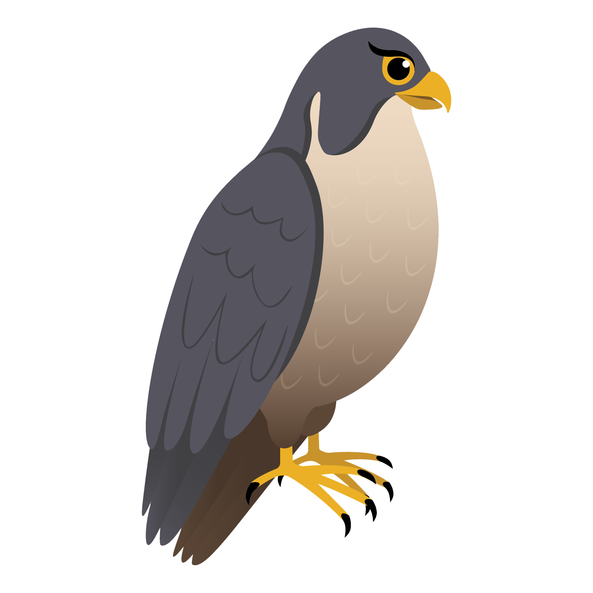

# Falcon theme documentation

<figure><figcaption></figcaption></figure>

The Falcon theme is the best choice for your next project as it offers exceptional page speed. This theme has been developed using the most up-to-date tools, including Webpack and WebpackDevServer with HMR (Hot Module Replacement) for seamless development. It also utilizes Bootstrap 5 for robust framework support.

The primary objective of Falcon is to provide developers with a modern and feature-rich starter theme that incorporates the latest tools and frameworks. With Falcon, you can effortlessly create and maintain an enterprise-level PrestaShop theme, while ensuring simplicity in maintenance tasks.
